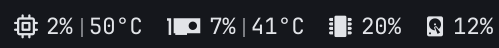
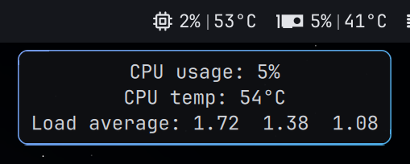
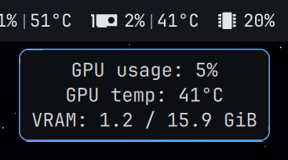
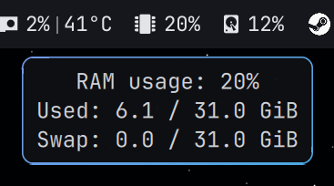
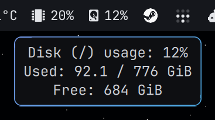

# Simple sysstats for Omarchy

CPU, GPU, RAM and disk usage (with CPU/GPU temperatures) for the Omarchy bar.



Hover any stat for details:

| CPU | GPU |
|---|---|
|  |  |
| **RAM** | **Disk** |
|  |  |

- **Lightweight.** CPU, RAM, temperatures and AMD GPU figures are read straight from `/proc` and `/sys` inside the shell, with no scripts or subprocesses on each refresh. Only disk usage (`df`) and NVIDIA GPUs (`nvidia-smi`) run a command.
- **Hardware detection.** CPU temperature from `k10temp`/`zenpower` (AMD), `coretemp` (Intel), `x86_pkg_temp`, `cpu_thermal` (ARM) or `acpitz`. GPU from AMD sysfs or `nvidia-smi`; the discrete GPU is picked automatically.
- **Three views.** Left-click cycles between all values, first value only and icon only. The choice is shared across monitors and kept across restarts.
- **Warnings.** The widget turns the theme's urgent colour at 90% usage or 85 °C (configurable).
- Hover for details (load average, swap, VRAM, free space). Right-click opens `btop`.

## Install

```bash
omarchy plugin add https://github.com/AlexMedela/simple-sysstats.git --enable
```

The widget is added once, showing CPU. Add it again for each stat you want and set its `stat` in the bar settings panel or in `~/.config/omarchy/shell.json`:

```json
"right": [
  { "id": "amedela.simple-sysstats", "stat": "CPU" },
  { "id": "amedela.simple-sysstats", "stat": "GPU" },
  { "id": "amedela.simple-sysstats", "stat": "RAM" },
  { "id": "amedela.simple-sysstats", "stat": "Disk", "mount": "/" }
]
```

## Settings

| Key | Default | Description |
|---|---|---|
| `stat` | `CPU` | `CPU`, `GPU`, `RAM` or `Disk` |
| `interval` | `3` (`30` for disk) | Refresh interval in seconds |
| `showTemperature` | `true` | Show CPU/GPU temperature |
| `mount` | `/` | Disk only: filesystem to report |
| `gpuCard` | auto | GPU only: pin a DRM card, e.g. `card1` |
| `usageThreshold` | `90` | Usage (%) that triggers the warning colour |
| `temperatureThreshold` | `85` | Temperature (°C) that triggers the warning colour |
| `onRightClick` | `omarchy-launch-or-focus-tui btop` | Command on right-click |
| `onMiddleClick` | — | Command on middle-click |
| `icon`, `iconSize`, `fontSize` | auto | Override the Nerd Font glyph and sizes |
| `viewMode` | `0` | Starting view: `0` all values, `1` first value, `2` icon only |

## Hardware support

| | Usage | Temperature |
|---|---|---|
| AMD CPU | ✅ | ✅ `k10temp` / `zenpower` |
| Intel CPU | ✅ | ✅ `coretemp` |
| AMD GPU (amdgpu) | ✅ | ✅ |
| NVIDIA GPU | ✅ needs `nvidia-smi` (proprietary driver) | ✅ |
| Intel GPU | ❌ not exposed by the driver (shows N/A) | — |

## Uninstall

```bash
omarchy plugin remove amedela.simple-sysstats
```

## License

MIT
